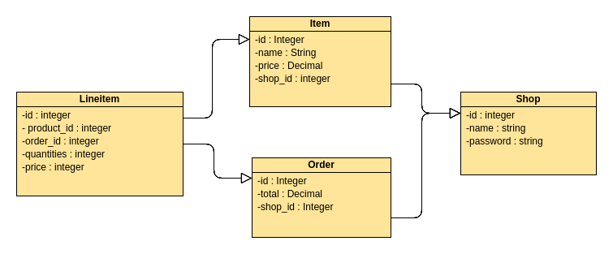
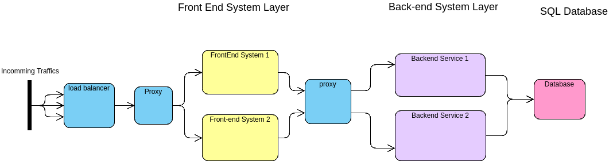

# A Scalable Shop Web Service

A simple Shop API server in Ruby with basic functionalities. This is built for Shopify developer challenge.

<br/>


## Table of Content

1. [Installaltions](#Installations)
2. [Basic Usage](#Usage)
3. [Demo](#Usage)
4. [Design](#Design)
5. [Development](#Development)
6. [API Docs](#Docs)
   * [Authentication API](#Auth)
   * [Shop API](#Shop)
   * [Product API](#Product)
   * [Order API](#Order)
7. [Deployment](#Deployment)

<br/>


## Installations <a name="Installations"></a>
download / clone with

    git clone https://github.com/anthonyho007/shop-api-server.git

to install postgresql, and rails on your local machine, you can follow the links

    https://www.digitalocean.com/community/tutorials/how-to-setup-ruby-on-rails-with-postgres

    https://gorails.com/setup/ubuntu/18.10

to install the project dependencies

    cd shop-api-server

    bundle install

    rake db:setup

to start the server

    rails s
<br/>

## Basic Usage <a name="Usage"></a>

You would need to sign in or sign up with a shop account in order to retrieve an authorization token for you to modify any products or orders using Product, Order, and Shop API.

    curl -X POST -H 'Content-Type: application/json' -d '{"name":"AnthonyHo","password":"foobar"}' http://<ip-address>/signin

    Response
    {
        "id": 1,
        "name": "AnthonyHo",
        "token": "eyJhbGciOiJIUzI1NiJ9.ey.71gfw-NLCRoU2W-t00sdLljTfLUFXzy32HhllCW1-9s"
    }

All Shop, Product and Order API would require you to pass in the token for authorization in the header

    curl -H 'Authorization: eyJhbGciOiJIUzI1NiJ9.ey.71gfw-NLCRoU2W-t00sdLljTfLUFXzy32HhllCW1-9s' http://<ip-address>/orders

Please refer to the API Docs below for more detailed usage.
<br/>

## Demo <a name="Demo"></a>

A standalone api server is hosted through google cloud platform at http://35.232.174.37 .

Feel free to play arourd with this server by signin with name="AnthonyHo" and password="foobar"

A complete web application including both front-end and backend system is hosted at http://35.225.110.21.

<br/>

## Design<a name="Design"></a>


### Database design / relationship



Each items and orders should belongs to a shop, since a shop cant sell a product or place an order that is not theirs. In another word, a shop can only fetch items that belongs to them. Order and product relationship is reinforced by has many through association where order has many products through Lineitems, because we dont want to aggregate each product into the order object and that will defeats the purpose of relational database. In this way, we could easily determine the quantities of a product needed in order to fulfill multiple orders or to obtain the amount of products that we sold through the order.

### CRUD

CRUD opperation on resources/ models are supported through different REST API endpoints.

### Security

All API requests except Authentication API would require user to pass in Authorization token in the header and the token can be obtain through Authentication API.

### Deloyment

A demo of the standalone API server (http://35.232.174.37) is hosted on Google Cloud Platform on top of a kubernette engine with a docker image of the API server.


A full web application including front-end and backend end system is hosted on Google kubernetes Engine through this address. http://35.225.110.21/

### Scalability



Utilized service discovery in kubernetes to create isolation between front-end and backend system and to increase scalability of both system. The front-end system is designed to connect to a backend service dynamically using the cluster's local DNS server to achieve high scalability, instead of having a front-end system tied to any specific backend server instance. When the frontend system wants to issue an API request to the backend system, it would first look up for the DNS of the target backend service then it would travel through ip tables and kubernetes proxy to arrive to the corresponding backend services for the API request. Though this architecture, an user can add, remove, update any system without having an impact on the other system and it would minimize downtime.


<br/>

### Front-end system

The frontend portion of this web application can be found through the following github link

    https://github.com/anthonyho007/shop-api-front

## Development<a name="Development"></a>

To run Unit Tests

    bundle exec rspec -fd

<br/>

## API Docs<a name="Docs"></a>
<br/>

### Authenticate API<a name="Auth"></a>
<br/>

#### Authenticate API Endpoints

The following API will let you create or log in to your own shop

    * POST /signin
    Login with current shop credentials and returns a token for authentication

    * POST /signup
    Creates a new shop and returns a token for authentication

<br/>

#### Sign in with existing shop credentials

**POST      /signin**
-H 'Content-Type: application/json'
```sh
{
    "name": "Anthony Ho",
    "password": "foolb"
}

```
**Response**
```sh
{
    "id": 1,
    "name": "AnthonyHo",
    "token": "eyJhbGciOiJIUzI1NiJ9.eyJzaG9wX2lkIjI3IylfPT_dtFM"
}
```
<br/>

#### Create a new shop through signup

**POST      /signup**
-H 'Content-Type: application/json'
```sh
{
    "name": "Anthony Ho",
    "password": "foolb"
}

```
**Response**
```sh
{
    "id": 2,
    "name": "TonyHo",
    "token": "eyJhbGciOiJIUzI1NiJ9.eyJzaG9wX2lkIjoyLmcbw1vqFQ4"
}

```

<br/>

### Shop API<a name="Shop"></a>
<br/>

#### Shop API Endpoints 

The following API will let you query or modify your own shop properties

    * GET /shop/:id
    retrieves your shop properties

    * PUT /shop/:id
    Changes your shop properties

    * DELETE /shop/:id
    Delete your shop

<br/>

#### Get Shop properties

**GET      /shops/:id**           
-H 'Authorization: [token]'

**Response**
```sh
{
    "shop": {
        "id": 1,
        "name": "AnthonyHo",
        "created_at": "2018-09-21T00:15:45.652Z"
    }
}

```
<br/>

#### Update Shop properties

**PUT      /shops/:id**           
-H 'Authorization: [token]'
-H 'Content-Type: application/json'
```sh
{
    "name": "Tony The Great",
    "password": "newPassword"
}

```
**Response**
```sh
{
    "shop": {
        "id": 1,
        "name": "Tony The Great",
        "created_at": "2018-09-21T00:15:45.652Z"
    }
}

```

<br/>

#### Delete Shop

**DELETE      /shop/:id**           
-H 'Authorization: [token]'

**Response**

```sh
HTTP/1.1 204 No Content
```

<br/>

### Product API<a name="Product"></a>

<br/>

#### Product API Endpoints

The following API will let you do the following with Product resources of your own shop

    * GET /products
    retrieves a list of products

    * GET /products/:id
    retrieve a specific product

    * POST /products/
    Create a new product

    * PUT /products/:id
    Updates a product

    * DELETE /products/:id
    Deletes a product

<br/>

#### Get all products

**GET      /products**           
-H 'Authorization: [token]'

**Response**
```sh
{
    "products": [
        {
            "created_at": "2018-09-21T00:26:14.627Z",
            "id": 1,
            "name": "CherryMxBlue keyboard",
            "price": "12.22",
            "shop_id": 1,
            "updated_at": "2018-09-21T00:26:14.627Z"
        },
        {
            "created_at": "2018-09-21T04:37:43.265Z",
            "id": 2,
            "name": "Happy Tree House Mouse",
            "price": "24.12",
            "shop_id": 1,
            "updated_at": "2018-09-21T04:37:43.265Z"
        }
    ]
}

```
<br/>

#### Get a specific product

**GET      /products/:id**           
-H 'Authorization: [token]'

**Response**
```sh
{
    "created_at": "2018-09-21T04:37:43.265Z",
    "id": 2,
    "name": "Happy Tree House Mouse",
    "price": "24.12",
    "shop_id": 1,
    "updated_at": "2018-09-21T04:37:43.265Z"
}

```

<br/>

#### Create a new product

**POST      /products/:id**           
-H 'Authorization: [token]'
-H 'Content-Type: application/json'
```sh
{
    "name": "Happy Tree House Mouse",
    "price": 24.12
}

```
**Response**
```sh
{
    "created_at": "2018-09-21T04:37:43.265Z",
    "id": 2,
    "name": "Happy Tree House Mouse",
    "price": "24.12",
    "shop_id": 1,
    "updated_at": "2018-09-21T04:37:43.265Z"
}

```

<br/>

#### Update a specific product

**PUT      /products/:id**           
-H 'Authorization: [token]'
-H 'Content-Type: application/json'
```sh
{
    "price": 12.00
}

```
**Response**
```sh
{
    "created_at": "2018-09-21T04:37:43.265Z",
    "id": 2,
    "name": "Happy Tree House Mouse",
    "price": "12.00",
    "shop_id": 1,
    "updated_at": "2018-09-21T04:37:43.265Z"
}

```

<br/>

#### Delete a product

**DELETE      /product/:id**           
-H 'Authorization: [token]'

**Response**

```sh
HTTP/1.1 204 No Content
```

<br/>

### Order API<a name="Order"></a>

<br/>

#### Order API Endpoints

The following API will let you do the following with Order resources of your own shop

    * GET /orders
    retrieves a list of orders

    * GET /orders/:id
    retrieves a specific order

    * POST /orders
    Create a new order with specific products and quantities

    * PUT /orders/:id
    Updates an order

    * DELETE /orders/:id
    Deletes an order

<br/>

#### Get all orders

**GET      /orders**          
-H 'Authorization: [token]'

**Response**
```sh
{
    "products": [
        {
            "created_at": "2018-09-21T00:26:14.627Z",
            "id": 1,
            "name": "CherryMxBlue keyboard",
            "price": "12.22",
            "shop_id": 1,
            "updated_at": "2018-09-21T00:26:14.627Z"
        },
        {
            "created_at": "2018-09-21T04:37:43.265Z",
            "id": 2,
            "name": "Happy Tree House Mouse",
            "price": "24.12",
            "shop_id": 1,
            "updated_at": "2018-09-21T04:37:43.265Z"
        }
    ]
}

```

<br/>

#### Get a specific order

**GET      /orders/:id**           
-H 'Authorization: [token]'

**Response**
```sh
{
    "order": {
        "id": 2,
        "lineitems": [
            {
                "price": "12.22",
                "product_id": 1,
                "quantities": 2
            }
        ],
        "total": "24.44"
    }
}


```

<br/>

#### Create a new order

**POST      /orders/:id**           
-H 'Authorization: [token]'
-H 'Content-Type: application/json'
```sh
{
    "product_ids_and_quantities": [
        {
            "product_id": 1,
            "quantities": 2
        },
        {
            "product_id": 2,
            "quantities": 4
        }
    ]
}

```
**Response**
```sh
{
    "order": {
        "id": 3,
        "lineitems": [
            {
                "price": "12.22",
                "product_id": 1,
                "quantities": 2
            },
            {
                "price": "24.12",
                "product_id": 2,
                "quantities": 4
            }
        ],
        "total": "120.92"
    }
}


```

<br/>

#### Update a specific order

**PUT      /orders/:id**           
-H 'Authorization: [token]'
-H 'Content-Type: application/json'
```sh
{
    "product_ids_and_quantities": [
        {
            "product_id": 1,
            "quantities": 1
        }
    ]
}
```
**Response**
```sh
{
    "order": {
        "id": 3,
        "lineitems": [
            {
                "price": "12.22",
                "product_id": 1,
                "quantities": 1
            }
        ],
        "total": "12.22"
    }
}

```

<br/>

#### Delete a order

**DELETE      /order/:id**           
-H 'Authorization: [token]'

**Response**

```sh
HTTP/1.1 204 No Content
```

## Deployment<a name="Deployment"></a>

In order to deploy this app to google cloud engine, you would first need a cluster for kubernettes and a database instance in CloudSQL. 

You can follow this guide to configure your clusters and database instance. 

    https://cloud.google.com/sql/docs/postgres/connect-kubernetes-engine

Then you would need to build the docker image and push it to google cloud registry

    docker build -t gcr.io/[YOUR_PROJECT_ID]/[APP_NAME] .

    gcloud docker -- push gcr.io/[YOUR_PROJECT_ID]/[APP_NAME]

### To deploy a standalone API server on Google Kerbenetes Engine
Replace PROJECTID and SQLCONNNAME in the files inside deployment/, You can now create deployment with the following commands and your app will be up on cloud.

    kubectl create -f deployment/psql_deployment.yaml
    kubectl create -f deployment/cloudsql-migrate.yaml
    kubectl create -f deployment/api-service.yaml

### To deploy the entire web application with both frontend and backend system
Replace PROJECTID and SQLCONNNAME in the files inside deployment/, run the following to create the backend replaction controllers and services.

    kubectl create -f deployment/backend-rc.yaml
    kubectl create -f deployment/backend-srv.yaml

Following the link below to deploy the replication controllers and services for front-end system. 

    https://github.com/anthonyho007/shop-api-front
